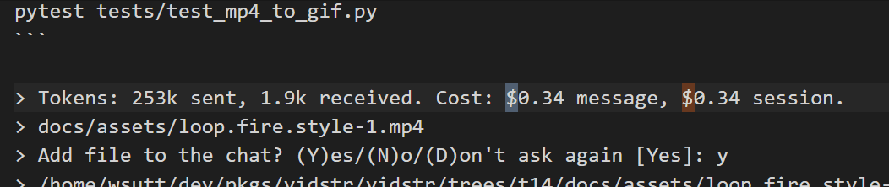

# Agent-Aider

Fork of [Aider](https://github.com/aider-ai/aider) with agentic capabilities:
- Allows aider to **run any shell script without manual confirmation**, 
  - This works for when aider is in "agent mode" as a background mode.
- Allow aider to run **more than max 3 relections** per confirmation
  - This also works for background mode.

Basically this allows aider to run fully agentically, like Claude Code in `--dangerously-skip-permissions`.

The primary use-case is using it with [Agro](https://github.com/sutt/agro), see case-studies like [this](https://github.com/sutt/agro/blob/master/docs/case-studies/aba-5.md#maider-as-wrapper-for-aider--aider-yolo) and [this](https://github.com/sutt/agro/blob/master/docs/case-studies/aba-vidstr-2.md#agentic-behavior).

---

[Installing](#setup) this repo will install a python script `agentaider` with the exact capabilities as aider except for the behavior listed above.

> ⚠️ **This is a dangerous script: agent-aider may run destructive commands or run up bills on your LLM provider.**



### Setup

**Get release version from git:** Clone the repo and checkout the tag corresponding to the aider version you want. Available version can be seen on github release page [here](https://github.com/sutt/agent-aider/releases).

```bash
git clone https://github.com/sutt/agent-aider
git checkout v0.85.5  # or whatever version you want that's available
```

**Recommended:** uv tool local install

You can use the script in the repo: `./redeploy` or, manually:

```bash
uv tool uninstall agent-aider
uv tool install . --no-cache
```

**Check install:**

```bash
$ uv tool list
# agent-aider v0.86.1.dev7+g085542cc
# - agentaider
# aider-chat v0.85.5
# - aider
# agro v0.1.7
# - agro

$ agentaider --version
# agentaider 0.86.1.dev7+g085542cc  # something like this
```

### Usage Instructions:

You'll need to pass along an additional flags for full agentic mode: `--yes` or `-y`.


### Resources

This fork addresses several open tickets on Aider:
- [Feature request: "YOLO" mode (#3830)](https://github.com/aider-ai/aider/issues/3830)
- [Extend aiders --yes option (#1375)](https://github.com/aider-ai/aider/issues/1375)
- [Running with `--yes-always` doesn't run shell commands (#3903)](https://github.com/aider-ai/aider/issues/3903)
- [Add ability to configure max_reflections setting (#3865)](https://github.com/Aider-AI/aider/issues/3865)

### Optional Setup 

It can help to have a control switch to run aider vs agentaider:

```bash
touch ~/.local/bin/maider
chmod +x ~/.local/bin/maider
```

**maider**
```bash
if ["$1" == "--yolo"]; then
   echo "CAUTION: yolo mode enabled ...using agentaider"
   agentaider \
      --yes \
      "$@"
else
   aider "$@"
fi
```

Putting that script on shell path, now you can call `maider` and pass `--yolo` to it optionally to run `agentaider` or fall back to regular aider otherwise.